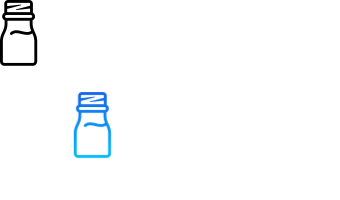

<!-- PROJECT LOGO -->

  <h1 align="center">OTC API</h1>

  
 
    <a href="https://github.com/feliceforgione/otc_api/issues">Report Bug</a>    
    ·
    <a href="https://github.com/feliceforgione/otc_api/issues">Request Feature</a>
  

<!-- ABOUT THE PROJECT -->
 

## About The Project

API to provide information about over the counter medications.

|                                                             |                                                                               |
| ----------------------------------------------------------- | ----------------------------------------------------------------------------- |
|  |  |
|                                                             |                                                                               |

### Built With

|                                         |                                      |
| --------------------------------------- | ------------------------------------ |
| [Node.js](https://nodejs.org/en/)       | [Express.js](https://expressjs.com/) |
| [MongoDB](https://www.mongodb.com/)     | [Swagger](https://swagger.io/)       |
| [Jenkins](https://www.jenkins.io/)      | [Docker](https://www.docker.com/)    |
| [Tailwindcss](https://tailwindcss.com/) | [Jest](https://jestjs.io/)           |

 

<!-- Usage -->

## Setup

- Install packages `npm install`
- Setup `.env` file based off `.env=sample`
- Start docker container `docker-compose -f docker-compose.yml -f docker-compose.dev.yml up -d --build`

<!-- Usage -->

## Usage

To start API server: `npm start`

To run tests: `npm run test`

Server can be accessed at: `http://localhost:3000/`

API documentation can be found at: `http://localhost:3000/api-docs/`

API can be accessed at: `localhost:3000/api/v1`
 
 

<!-- ROADMAP -->

## Roadmap

- [ ] Add more entries into database
- [ ] Add Uses, Ingredients, Warnings, and/or Additional Information fields

 

See the [open issues](https://github.com/feliceforgione/otc_api/issues) for a full list of proposed features (and known issues).

 

<!-- CONTRIBUTING -->

## Contributing

Contributions are what make the open source community such an amazing place to learn, inspire, and create. Any contributions you make are **greatly appreciated**.

If you have a suggestion that would make this better, please fork the repo and create a pull request. You can also simply open an issue with the tag "enhancement".
Don't forget to give the project a star! Thanks again!

1. Fork the Project
2. Create your Feature Branch (`git checkout -b feature/AmazingFeature`)
3. Commit your Changes (`git commit -m 'Add some AmazingFeature'`)
4. Push to the Branch (`git push origin feature/AmazingFeature`)
5. Open a Pull Request

 
<!-- CONTACT -->

## Contact

Felice Forgione - [@forgione67](https://twitter.com/forgione67)

Project Link: [https://github.com/feliceforgione/otc_api](https://github.com/feliceforgione/otc_api)
